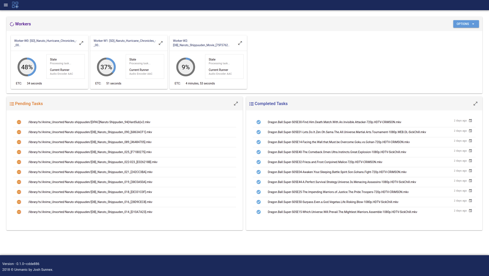
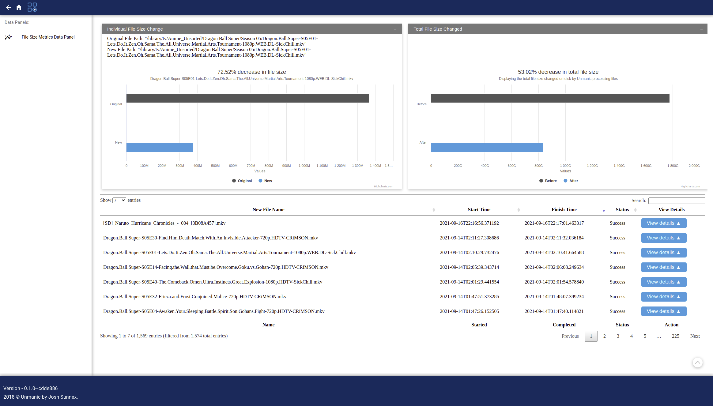
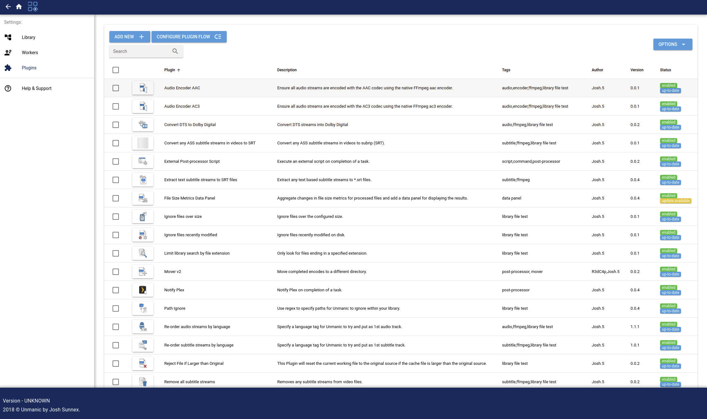

# COMPRESSO — Media Library Optimizer

Compresso is a media library optimizer with approval workflow, compression dashboard, A/B preview, and health checks. Originally forked from [Josh5/Unmanic](https://github.com/Unmanic/unmanic), it has diverged significantly with new features and deployment hardening.

### Key Features

- **Approval workflow** — transcoded files are held for review before replacing originals. Compare original vs. compressed file size and quality, then approve to replace or reject to keep the original untouched.
- **Compression dashboard** — monitor per-library breakdowns, codec distribution charts, space-saved timelines, and pending compression estimates. Track compression ratios, space savings, and processing stats at a glance.
- **A/B preview** — side-by-side video comparison of source vs. encoded output with VMAF/SSIM quality scores, so you can verify quality before committing changes.
- **Health checks** — library-wide scanning with quick and thorough modes, per-file status tracking, and a readiness endpoint at `/compresso/api/v2/healthcheck/readiness`.
- **Multi-machine links** — distribute processing across multiple Compresso instances with automatic task routing, file transfer, and worker coordination.
- **Plugin system** — extend Compresso with community plugins for file testing, processing, and post-processing workflows.
- **Large-library safe defaults** — conservative worker cap, explicit cache path
- Frontend vendored in-repo (no submodule/recursive clone required)
- Node.js 24 build baseline, validated in CI
- SQLite maintenance on container startup
- Structured log markers for startup/worker/post-processing failures

### Quick Start (Docker)

```bash
docker run -d \
  --name compresso \
  -p 8888:8888 \
  -v /path/to/media:/library \
  -v compresso-config:/config \
  jtn0123/compresso:latest
```

Then open http://localhost:8888 in your browser.

### Supported Deploy Paths

- **Docker (recommended)** — see [`docker/docker-compose.yml`](docker/docker-compose.yml) and [`docs/FORK_DEPLOYMENT.md`](docs/FORK_DEPLOYMENT.md)
- **Source** — see [Install and Run](#install-and-run) below

---

### Table Of Contents

[Dependencies](#dependencies)

[Screen-shots](#screen-shots)

[Install and Run](#install-and-run)

[License and Contribution](#license-and-contribution)


## Dependencies

 - Python 3.x ([Install](https://www.python.org/downloads/))
 - To install requirements run 'python3 -m pip install -r requirements.txt' from the project root

Since Compresso can be used for running any commands, you will need to ensure that the required dependencies for those commands are also installed on your system.

## Screen-shots

#### Dashboard:

#### File metrics:

#### Installed plugins:


## Install and Run

To run from source:

1) Install Python 3 and Node.js 24.x.
2) Install Python build dependencies:
    ```
    python3 -m pip install -r requirements.txt -r requirements-dev.txt
    ```
3) Optionally run the frontend validation steps used in CI:
    ```bash
    cd compresso/webserver/frontend
    npm ci
    npm run lint
    npm run build:publish
    cd ../../..
    ```
4) Build and install the package:
    ```bash
    rm -rf build dist
    python3 -m build --no-isolation --skip-dependency-check --wheel
    python3 -m pip install --user "$(find dist -maxdepth 1 -type f -name '*.whl' | sort | tail -n 1)"
    ```
5) Run Compresso:
    ```bash
    compresso
    ```
6) Open your web browser and navigate to http://localhost:8888/

Node.js 24 is the supported frontend build baseline. Node 22 may still work, but CI and release validation now use Node 24.

The Python package build performs its own clean frontend install from the committed lockfile, so a pre-existing `node_modules` directory is not required.

For a production-focused source or Docker workflow, including a deployment checklist for large libraries, see [docs/FORK_DEPLOYMENT.md](./docs/FORK_DEPLOYMENT.md).

### Architecture

Compresso is built with Python/Tornado on the backend and Vue.js/Quasar on the frontend. Task state and history are stored in SQLite. Media processing is handled by configurable worker groups that execute plugin-defined commands (typically FFmpeg). The plugin system supports three hook points: library management (file testing), worker processing, and post-processing. Multiple Compresso instances can be linked for distributed processing.

### Configuration

Compresso stores its configuration in `~/.compresso/`:
- `~/.compresso/config/` — settings.json and database
- `~/.compresso/logs/` — application logs
- `~/.compresso/plugins/` — installed plugins
- `~/.compresso/userdata/` — user data

## Troubleshooting

**Port already in use**
If port 8888 is taken, specify a different port: `compresso --port 9999`. In Docker, set `PORT=9999` in your container environment.

**FFmpeg not found**
Compresso plugins that use FFmpeg require it to be installed and on the system PATH. Install via your package manager: `apt install ffmpeg` (Debian/Ubuntu), `brew install ffmpeg` (macOS), or include it in your Docker image.

**Library permission errors**
Ensure the Compresso process (or Docker container) has read/write access to your media library path. For Docker, verify your volume mount permissions.

**Database locked errors**
SQLite can report "database is locked" under heavy concurrent access. Compresso runs maintenance on startup to mitigate this. If persistent, reduce worker count or ensure only one Compresso instance accesses the config directory.

## License and Contribution

This projected is licensed under the GPL version 3.

Copyright (C) Josh Sunnex - All Rights Reserved

Permission is hereby granted, free of charge, to any person obtaining a copy
of this software and associated documentation files (the "Software"), to deal
in the Software without restriction, including without limitation the rights
to use, copy, modify, merge, publish, distribute, sublicense, and/or sell
copies of the Software, and to permit persons to whom the Software is
furnished to do so, subject to the following conditions:

The above copyright notice and this permission notice shall be included in all
copies or substantial portions of the Software.

This project contains libraries imported from external authors.
Please refer to the source of these libraries for more information on their respective licenses.

---
