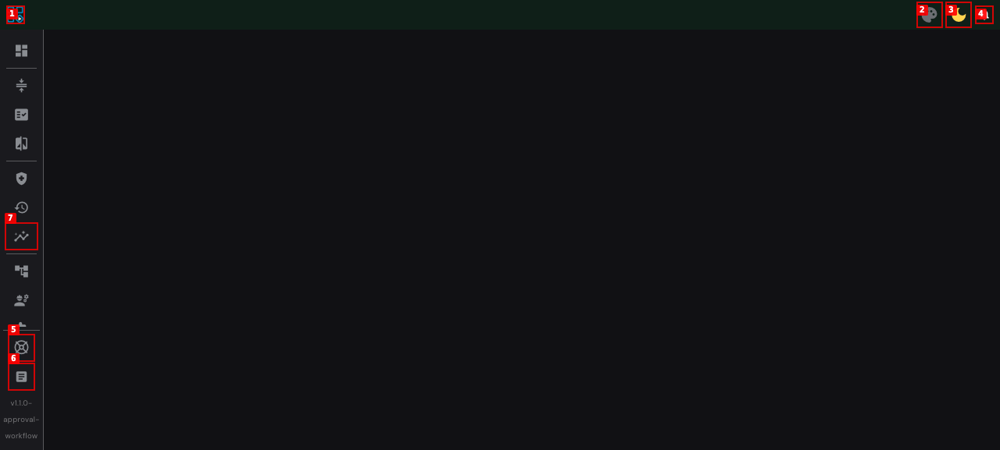

# Dogfood Report: Compresso

| Field | Value |
|-------|-------|
| **Date** | 2026-03-30 |
| **App URL** | http://localhost:8889/compresso/ |
| **Session** | compresso-dogfood |
| **Scope** | Full app UI exploration and polish assessment |

## Summary

| Severity | Count | Fixed |
|----------|-------|-------|
| Critical | 1 | 1 |
| High | 1 | 1 |
| Medium | 2 | 1 |
| Low | 4 | 4 |
| **Total** | **8** | **7** |

## Issues

### ISSUE-001: Missing i18n translations across 6+ pages -- FIXED

| Field | Value |
|-------|-------|
| **Severity** | critical |
| **Category** | content |
| **URL** | Multiple pages |
| **Status** | FIXED |

**Description**

Raw i18n translation keys displayed instead of actual text on Approval Queue, Compression Dashboard, Health Check, Task History, A/B Preview, Data Panels, and 404 Error pages. Caused by path mismatch: components used `$t('pages.XXX')` but translations lived under `components.pages.XXX` in en.json.

**Fix:** Moved `components.pages` to root-level `pages` key in `src/language/en.json`.

---

### ISSUE-002: Task History page throws uncaught runtime errors -- FIXED

| Field | Value |
|-------|-------|
| **Severity** | high |
| **Category** | functional |
| **URL** | http://localhost:8889/compresso/ui/history |
| **Status** | FIXED |

**Description**

Navigating to Task History produced a full-screen red "Uncaught runtime errors" overlay blocking all content due to API 429 responses. The webpack dev server overlay was showing runtime errors by default.

**Fix:** Configured `devServer.client.overlay` in `quasar.config.cjs` to disable `runtimeErrors` and `warnings` overlays while keeping compile `errors` visible.

---

### ISSUE-003: Trigger page renders completely blank

| Field | Value |
|-------|-------|
| **Severity** | medium |
| **Category** | functional |
| **URL** | http://localhost:8889/compresso/ui/trigger |
| **Status** | OPEN |

**Description**

The Trigger page renders with only the sidebar visible -- the entire main content area is empty. No error overlay, no console errors specific to this page. May require backend API data or configuration to render content.

---

### ISSUE-004: Backend API errors on startup (500, 429)

| Field | Value |
|-------|-------|
| **Severity** | medium |
| **Category** | console |
| **URL** | http://localhost:8889/compresso/ui/dashboard |
| **Status** | OPEN (backend issue) |

**Description**

Multiple backend API errors in console on page load:
- `[SystemStatus] Failed to fetch system status: 500`
- `[SharedLinks] Failed to fetch shared links`
- `Failed to fetch settings for onboarding check: 429`

These are backend-side issues, not frontend bugs.

---

### ISSUE-005: 8 Vue Router warnings on every page load -- FIXED

| Field | Value |
|-------|-------|
| **Severity** | low |
| **Category** | console |
| **URL** | All pages |
| **Status** | FIXED |

**Description**

Every page navigation produced 8 Vue Router warnings about named parent routes with unnamed children.

**Fix:** Moved `name` from parent route to child route in `src/router/routes.js` for all 8 affected routes.

---

### ISSUE-006: Data Panels empty state uses oversized warning icon -- FIXED

| Field | Value |
|-------|-------|
| **Severity** | low |
| **Category** | ux |
| **URL** | http://localhost:8889/compresso/ui/data-panels |
| **Status** | FIXED |

**Description**

512px red warning triangle icon filled the viewport for an unconfigured state. Replaced with a neutral 64px "extension" icon with centered layout.

---

### ISSUE-007: Version text wraps awkwardly in collapsed sidebar -- FIXED

| Field | Value |
|-------|-------|
| **Severity** | low |
| **Category** | visual |
| **URL** | http://localhost:8889/compresso/ui/dashboard |
| **Status** | FIXED |

**Description**

Version string "v1.1.0-approval-workflow" wrapped across 3 lines in the collapsed sidebar.

**Fix:** Added `white-space: nowrap; overflow: hidden; text-overflow: ellipsis` to version text in `DrawerMainNav.vue`.

---

### ISSUE-008: 11 ESLint warnings across 8 components -- FIXED

| Field | Value |
|-------|-------|
| **Severity** | low |
| **Category** | console |
| **URL** | N/A |
| **Status** | FIXED |

**Description**

11 ESLint warnings from `vue/require-default-prop`, `vue/no-template-shadow`, and `vue/first-attribute-linebreak` rules across 8 Vue components. All fixed with minimal changes (added prop defaults, renamed shadowed variables, fixed attribute linebreaks).

---

## Files Changed

| File | Change |
|------|--------|
| `src/language/en.json` | Moved `components.pages` to root-level `pages` |
| `src/router/routes.js` | Moved route `name` from parent to child on 8 routes |
| `quasar.config.cjs` | Disabled runtime error overlay in dev server |
| `src/pages/DataPanels.vue` | Replaced 512px warning icon with neutral empty state |
| `src/components/drawers/DrawerMainNav.vue` | Fixed version text overflow |
| `src/components/MobileSettingsQuickNav.vue` | Added prop defaults |
| `src/components/dashboard/completed/CompletedTasksListDialog.vue` | Renamed shadowed `props` variable |
| `src/components/dashboard/workers/partials/WorkerProgressLogCard.vue` | Added prop default |
| `src/components/dashboard/workers/partials/WorkerProgressStatusCard.vue` | Added prop default |
| `src/components/settings/library/partials/LibraryConfigurePluginFlowList.vue` | Added prop default |
| `src/components/settings/plugins/PluginInfoDialog.vue` | Added prop default |
| `src/pages/ApprovalQueue.vue` | Fixed attribute linebreak |
| `src/pages/SettingsLibrary.vue` | Renamed shadowed `index` variable |
